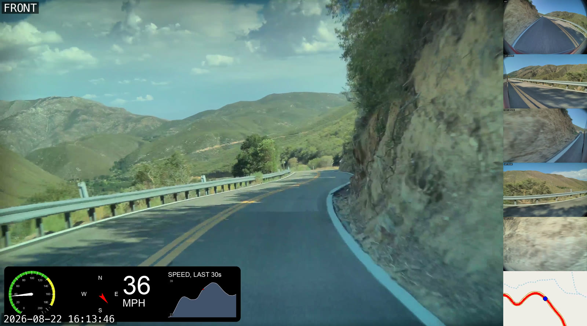

# teslacam-studio

Turn a Tesla **Sentry / Dashcam** event folder into a single, labeled multi-camera
grid video — with a burned-in wall clock, optional face blurring, and an optional
**live GPS route-map tile** built from the telemetry Tesla embeds in the footage.



Tesla saves each camera as its own ~1-minute clip. teslacam-studio stitches them
per-camera, then composites them into one grid you can actually watch — front
featured large, repeaters and pillars paired, back paired with a moving map that
traces where you drove.

---

## Features

- **Multi-camera grid** from whichever of the 6 angles are present (front, back,
  left/right repeater, left/right pillar) — you don't need all six.
- **Burned-in wall clock** computed from the clips' real timestamps.
- **Trim** to a wall-clock window (`--trim-start 18:59:00 --trim-end 19:02:00`).
- **Feature/hero** any camera or pair large (`--feature back`, `--feature repeaters`).
- **Speed up** playback (`--speed 2`).
- **Face blurring** for privacy (`--blur-faces`, via [`deface`](https://github.com/ORB-HD/deface)).
- **Live GPS route map** (`--map`) — a moving map that follows the car and draws
  the route, extracted from the car's own GPS telemetry. Tunable zoom/magnification.
- **Landscape layout** (`--landscape`) — the featured camera at full native
  resolution on the left, every other camera (and the map, if any) in a thin
  sidebar column on the right, sized to match. Produces a real landscape
  aspect ratio instead of the default tall grid — use it for YouTube/social
  feed video, or whenever the tall grid's height pushes past the hardware
  encoder's cap and softens the featured camera.
- **Hardware-accelerated** H.264 encode (Apple VideoToolbox), with automatic
  scale-to-fit so the output stays on the hardware decode path — or force
  software encoding for its own sake with `--quality high` (libx264, CRF 18).
- **Caching** — per-camera concats are cached; re-running with different grid
  options doesn't re-stitch. Ctrl-C is safe: the half-written file is removed and
  the finished cameras are reused on the next run.
- **Live progress** — one display for the whole job: which step of how many is
  running, how far into it, and an ETA for the run as a whole (below).

## How the GPS map works

Newer Tesla firmware embeds per-frame telemetry — GPS, speed, heading, steering,
Autopilot state and more — as **SEI metadata inside the H.264 bitstream** (the
same data surfaced by [teslamotors/dashcam](https://github.com/teslamotors/dashcam)).
`tesla_gps.py` decodes it (no external libraries — a hand-rolled protobuf reader),
turns it into a GPX track re-timed to the concatenated grid timeline, and
[gopro-overlay](https://github.com/time4tea/gopro-dashboard-overlay) renders the
map tile, which is composited beside the back camera.

**GPS is only available when:**
- the car is on **firmware 2025.44.25 or later** and **HW3 or newer**, and
- the clips were recorded **while driving** (parked Sentry clips carry no telemetry).

Check whether a folder has GPS before rendering:

```bash
python3 tesla_gps.py /path/to/clips --probe
```

If a folder has no telemetry, `--map` prints a notice and builds the grid without
the map — nothing breaks.

## Watching a long run

A six-camera session with `--blur-faces --map` can run for hours, so the tool
plans the work up front and reports against that plan:

```
Plan: 14 steps (6 concat, 6 blur, map GPS, map render, grid) | ~31m 50s of footage per camera

[ 3/14] blur faces front         ████████░░░░░░░░  38%  ETA 22m 40s
        job                      ███░░░░░░░░░░░░░  11%  elapsed 6m 12s · ETA ~1h 48m
```

Nothing there is a guess from a timer — the percentages come from ffmpeg's own
progress stream and `deface`'s frame counter. The job ETA starts from rough
per-step estimates and **re-calibrates from measured throughput** as steps
finish, so it settles quickly (after the first camera's blur, the other five are
predicted from that measurement).

- Press **Ctrl-T** (macOS/BSD) at any time to print where the run is.
- Press **Ctrl-C** to stop: the incomplete output file is deleted, and re-running
  the same command picks up from the cameras already finished.
- Piping to a file switches to a plain progress line every ~15s (no escape codes).
- `--verbose` shows every command and the raw ffmpeg/deface output instead —
  what you want when something fails and you need to watch it happen.

---

## Requirements

- **macOS** (uses Apple VideoToolbox for hardware encode; the grid logic is
  otherwise portable).
- **ffmpeg with `drawtext`** — Homebrew's plain `ffmpeg` ships *without*
  libfreetype, so install `ffmpeg-full`:
  ```bash
  brew install ffmpeg-full
  ```
  The script auto-detects `ffmpeg-full` and falls back gracefully.
- **Python 3.9+** for the core tool (standard library only).
- For `--map`: **Python 3.10+** and `gopro-overlay` in a local venv (below).
- For `--blur-faces`: `pip install deface` (optional).

## Setup

```bash
git clone https://github.com/RezaAmbler/teslacam-studio.git
cd teslacam-studio

# Optional — only needed for the --map route overlay:
python3.12 -m venv .venv
./.venv/bin/python -m pip install gopro-overlay
```

The `--map` feature looks for `gopro-dashboard.py` inside `./.venv` and downloads
OpenStreetMap tiles on first use (so it needs network access).

### Running the tests

The tools themselves are stdlib-only; only the test suite needs a dependency:

```bash
python3 -m pip install -r requirements-dev.txt
python3 -m pytest
```

CI runs the suite on every push (Python 3.9 and 3.12).

---

## Usage

```bash
# Basic: combine an event folder into a labeled grid
python3 tesla_combine.py /path/to/event/folder

# Trim to a wall-clock window
python3 tesla_combine.py /path/to/event/folder --trim-start 18:59:00 --trim-end 19:02:00

# Feature the rear camera (e.g. you got rear-ended), at 2x speed
python3 tesla_combine.py /path/to/event/folder --feature back --speed 2

# Blur faces (needs `deface`)
python3 tesla_combine.py /path/to/event/folder --blur-faces

# Add a live GPS route-map tile (needs gopro-overlay in ./.venv)
python3 tesla_combine.py /path/to/event/folder --map

# Tighter, navigation-style map; or wider & sharper for highway
python3 tesla_combine.py /path/to/event/folder --map --map-mag 3
python3 tesla_combine.py /path/to/event/folder --map --map-mag 1 --map-zoom 16

# Landscape layout (real 16:9-ish aspect ratio) instead of the tall grid
python3 tesla_combine.py /path/to/event/folder --landscape --map

# Force software encoding for sharper output (slower)
python3 tesla_combine.py /path/to/event/folder --quality high

# See the ffmpeg commands without running anything
python3 tesla_combine.py /path/to/event/folder --dry-run
```

Run `python3 tesla_combine.py --help` for the full flag list.

### Key options

| Flag | Purpose |
|------|---------|
| `--trim-start` / `--trim-end` | `HH:MM:SS` wall-clock or seconds offset |
| `--speed` | Playback speed multiplier |
| `--feature` | Which camera/pair gets the large hero row |
| `--blur-faces` | Anonymize faces (`--blur-mode blur\|solid\|mosaic`) |
| `--map` | Add the live GPS route-map tile |
| `--map-zoom` | OSM tile zoom 1–19 (default 19) |
| `--map-mag` | Magnify beyond OSM's limit, 1.0–4.0 (default 2.0; 1 = off) |
| `--landscape` | Hero camera at native res + thin sidebar column, instead of the tall grid |
| `--native` | True native resolution (skips the hardware-fit scale-down) |
| `--quality` | `fast` (default, hardware) or `high` (software libx264, CRF 18) |
| `--output-dir` | Where outputs go (default: next to the input folder) |
| `-v` / `--verbose` | Full ffmpeg/deface output instead of the progress display |
| `--no-progress` | Plain progress lines, no live redraw (automatic when piped) |
| `--dry-run` | Print ffmpeg commands, do nothing |

## Input

Tesla's own clip naming, in one folder:

```
2026-07-14_18-57-37-front.mp4
2026-07-14_18-57-37-back.mp4
2026-07-14_18-57-37-left_repeater.mp4
...
```

## Output

Written next to the input folder unless `--output-dir` is given:

| File | What |
|------|------|
| `<session>_<angle>_combined.mp4` | one lossless concat per camera angle |
| `<session>_<angle>_blurred.mp4` | (with `--blur-faces`) that concat, faces anonymized |
| `<session>_maptile.mp4` | (with `--map`) the standalone live route-map tile |
| `<session>_grid[_landscape][_feature-X][_blurred][_map].mp4` | the labeled multi-camera composite |

`playcheck.sh <file.mp4>` runs headless playback sanity checks (decode integrity,
faststart index, hardware-decodable dimensions, constant frame rate).

---

## Credits

- **SEI telemetry format** — [teslamotors/dashcam](https://github.com/teslamotors/dashcam) (Tesla's own tools + `dashcam.proto`).
- **Map rendering** — [gopro-overlay](https://github.com/time4tea/gopro-dashboard-overlay).
- **Face anonymization** — [deface](https://github.com/ORB-HD/deface).
- Map data © OpenStreetMap contributors.

## License

MIT — see [LICENSE](LICENSE).
